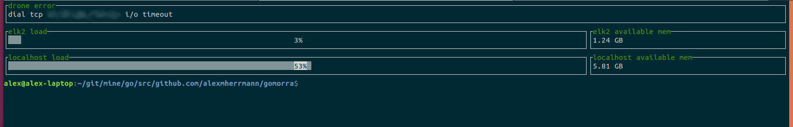

# A neat server monitor
Gomorra is a little tool that lets you monitor your linux instances exclusively over ssh. It's just a pet project
to get used to writing go code. More than anything I wanted to try and apply good concurrent coding practice
alongside some networking and error handling. This was only somewhat accomplished.

`dep` is used as the package manager. However, apparently it's idiomatic in go to commit dependent source code
now so the vendor folder contains all of the dependencies necessary. You'll just need to make sure you use a
version of go that has vendor folder support (available since 1.5 I believe) 

See the `example.config.json` for an example of how you should format the `config.json `(which needs to be in 
your working directory before you run gomorra). Additionally, a file `gomorra.log` is created that logs
out all kinds of occasionally useful information. It is especially necessary in this case because
the library I use to display information [termui](https://github.com/gizak/termui)
hijacks your TTY. After exiting the program you'll probably
want to run the command `reset`, which will clear your screen and undo all the damage
caused by running gomorra.

